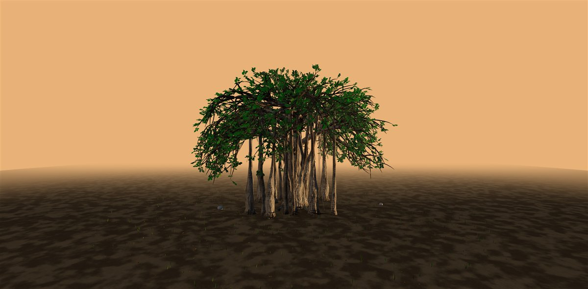
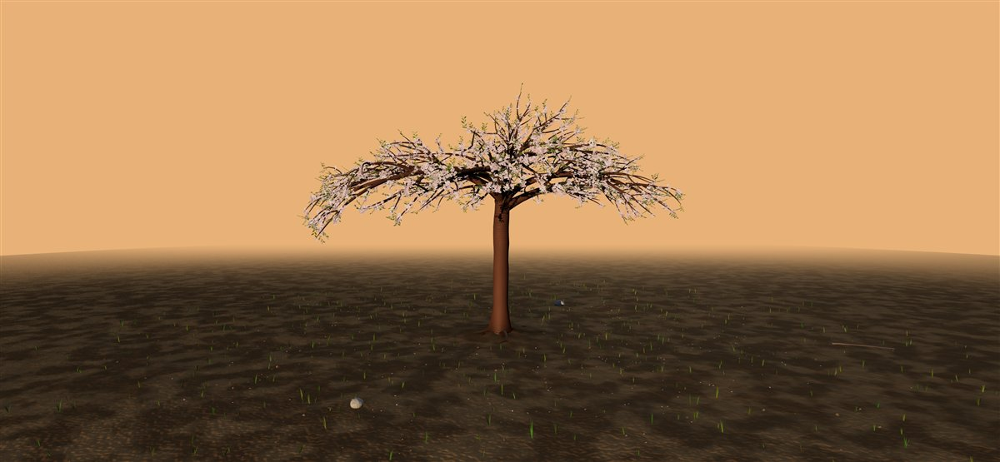
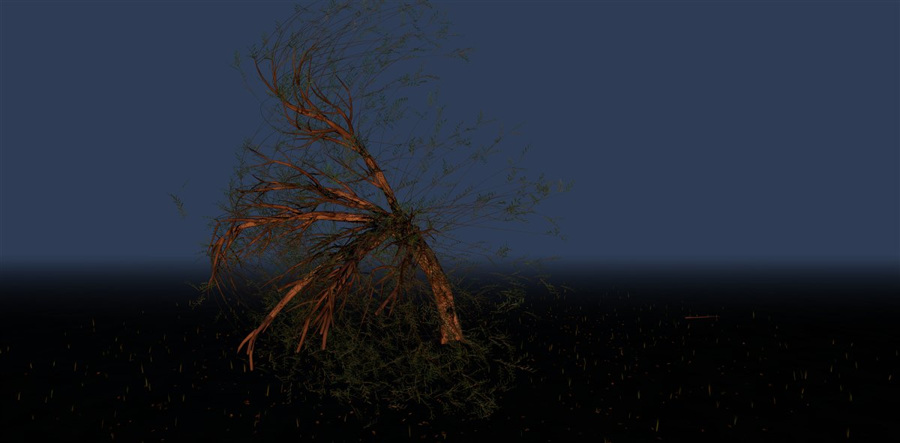

# Banyan

A zero-asset procedural tree engine for three.js.

Everything is grown from code: trunk, aerial roots, bark, leaves, blossoms,
ground, light. No models, no textures, no external files. A tree is a 32-bit
seed plus a JSON spec, and the same seed grows the same tree on every machine,
every time. Determinism is the point: a tree you can link to is a tree that
still exists tomorrow.


## See it

Double-click `dist/banyan.standalone.html`. It is a single self-contained file
and runs straight from disk — no server, no install. The address bar carries
deep links (`?species=&seed=&scene=&leaves=&quality=&view=`), so any tree you
find is shareable as a URL.

`dist/forest.standalone.html` grows every species side by side in one scene.

## Use it

The 60-second embed is an `<iframe>` around the standalone file. For real
integration, `dist/banyan.module.js` is an ES module (three.js r165 stays
external, loaded via a CDN import map). Four runnable examples are in
[examples/](examples/), simplest first.

## Build from source

```sh
npm install
node build.mjs
```

`src/` holds the readable modules — growth skeleton, mesher, materials, leaves,
species, scenes, picking, GLB export. Output is never minified: readability is
part of the product.

## The evolution

`banyan-bonsai_v2.html` through `banyan-bonsai_v5.html` at the root are the
engine's actual growth history — each a complete single-file artifact from that
stage, kept as it was. v5 is current, and is what `src/` and `dist/` continue.

## Scenes and species

Scenes are data: `scenes/*.scenespec.json` (white studio, golden hour, firefly
night, ink wash). Species are data too: a `TreeSpec` is a JSON object, and
`treespec/` documents the format. Change a few numbers, regrow the tree.

## Gallery

The first two captions are commands: paste them onto the standalone's URL and
the exact same tree grows for you. Same seed, same tree.

| | | |
|---|---|---|
|  |  |  |
| `?species=banyan&seed=126&scene=golden-hour` | `?species=cherry-blossom&seed=75&scene=golden-hour` | weeping willow, seed `4242` |

## Provenance

The engine and all shipped scenes are 100% procedural; zero external assets are
bundled. Full provenance table in [SOURCES.md](SOURCES.md). History in
[CHANGELOG.md](CHANGELOG.md).

This engine grew out of building [everbanyan.com](https://www.everbanyan.com),
a living tree memorial for pets.

## License

AGPL-3.0. See [LICENSE](LICENSE). In short: use it, learn from it, build with
it — and if you ship something built on it, your code must be open too. For a
commercial license outside those terms, contact the author.
