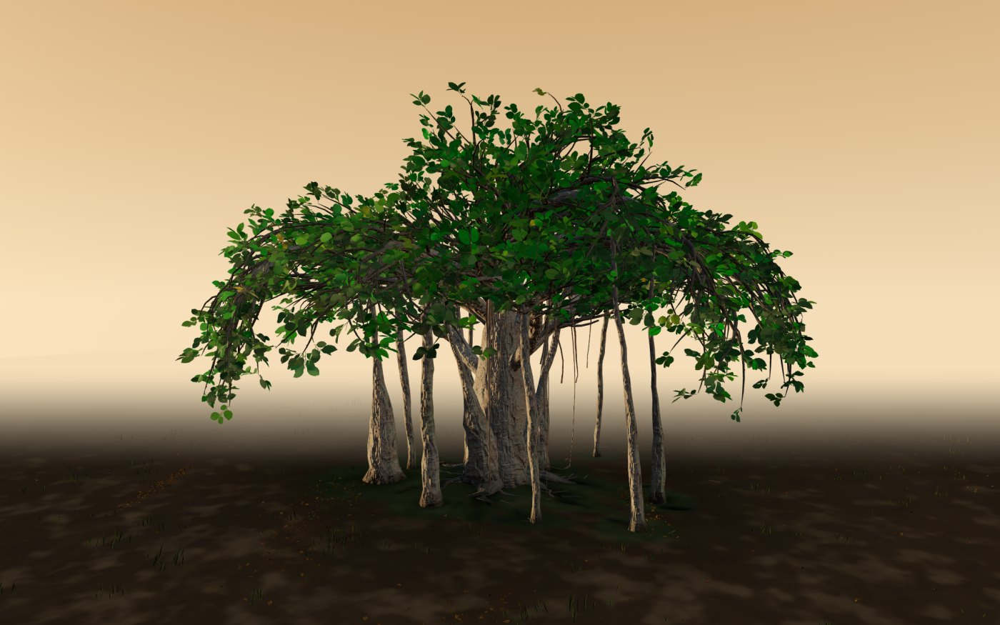
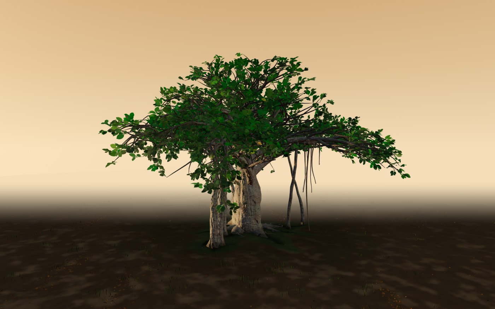

# Banyan

A procedural banyan tree study for three.js.

Everything is grown from code: trunk, aerial prop roots, bark, leaves, ground,
grass, litter, light. No models, no textures, no downloaded assets. A tree is a
32-bit seed, and the same seed grows the same tree on every machine, every
time. Determinism is the point: a tree you can link to is a tree that still
exists tomorrow.


## See it

Open `banyan_v5.html` in a browser. One self-contained file — three.js is baked
in by a reproducible build — so it runs from disk, fully offline. Drag to
orbit, tap a leaf for botanical details, press "copy tree link" to share the
exact tree you found. Deep links carry `?seed=&scene=&season=`.

## Gallery

Each caption is a command: put it on the standalone's URL and the same tree
grows for you.


`?seed=863&scene=golden-hour`

| | |
|---|---|
|  |  |
| `?seed=1653&scene=golden-hour` | `?seed=754&scene=golden-hour` |

## Gold seeds

Not every seed grows a great tree. [gold/](gold/) is the curated catalogue:
ten seeds selected from thousands of candidates, each with a preview image,
recorded in [gold/gold-banyan-1.json](gold/gold-banyan-1.json) with geometry
checksums — so a certified tree can be verified, not just admired. Seed `863`
("Sheltering") and seed `1653` ("Single Bough") are good places to start.

## Reproducible build

`banyan_v5.source.html` is the readable source: one HTML file, the engine in a
module script, three.js imported from [vendor/](vendor/) (r165, pinned,
provenance in `vendor/PROVENANCE.md`). The runtime is built from it:

```sh
npm install
npm run build     # writes banyan_v5.html
npm run check     # rebuilds in memory, compares byte-for-byte
```

The build LF-normalizes the source, bundles with a pinned esbuild, and stamps
the source hash into the runtime header — one clean build produces the same
bytes on Windows and Linux. You do not have to trust the shipped file; check it.

## The evolution

`banyan_v2.html` through `banyan_v4.html` are the engine's growth history —
complete single-file artifacts from each earlier stage, kept as they were.
`banyan_v5.html` is the current stage, as it matured in production through
August 2026.

## What this build does not include

The renderer grew inside [everbanyan.com](https://www.everbanyan.com), a living
tree memorial for pets. Its remembrance objects for faith traditions are not
part of this public build — they stay behind the product's own review
obligation, and the runtime's `capabilities.refusedObjects` says so explicitly
rather than leaving their absence to guesswork.

## Provenance and license

The engine and every scene are 100% procedural; zero external assets are
bundled (see [SOURCES.md](SOURCES.md)). three.js is MIT. This repository is
AGPL-3.0 — use it, learn from it, build with it; if you ship something built on
it, your code must be open too. For a commercial license outside those terms,
contact the author. See [LICENSE](LICENSE).
