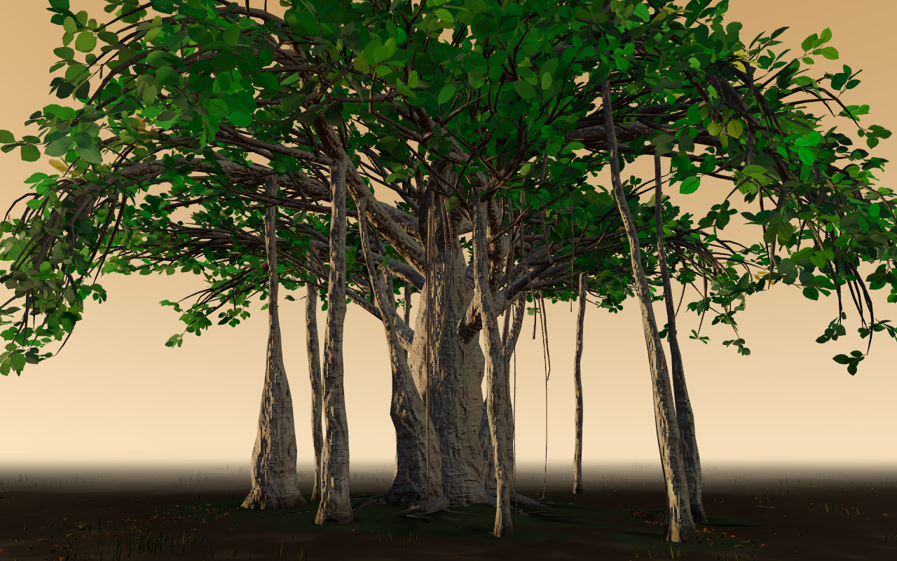
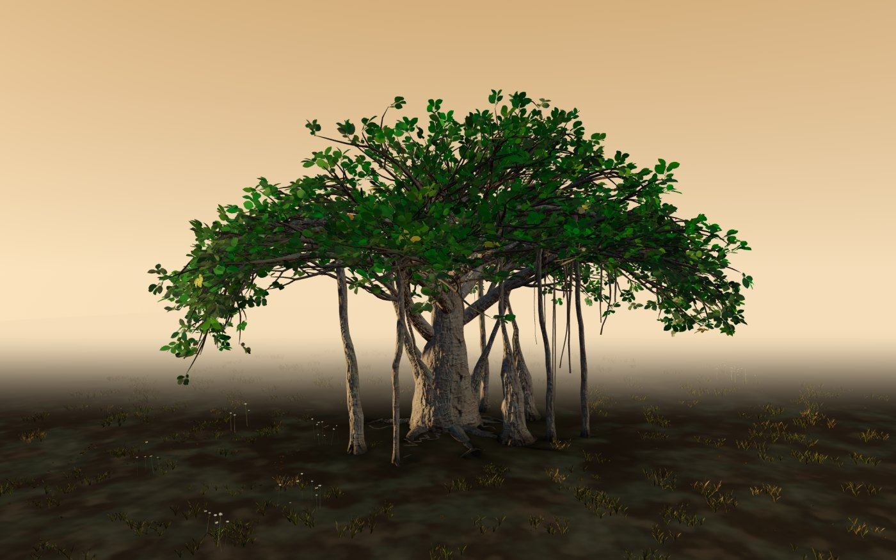
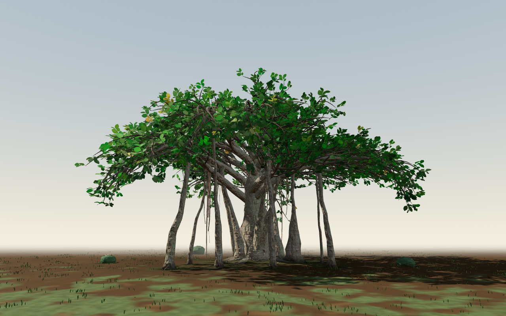
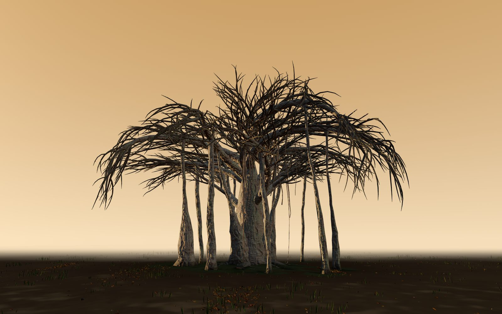
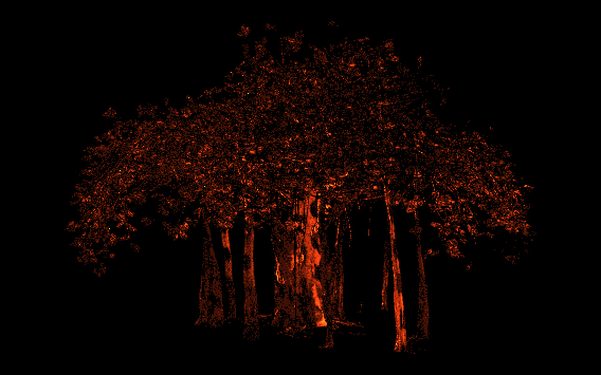

# Banyan

A procedural banyan tree study for three.js.

Everything is grown from code: trunk, aerial prop roots, bark, leaves, ground,
grass, litter, light. No models, no textures, no downloaded assets. A tree is a
32-bit seed, and the same seed grows the same tree on every machine, every
time. Determinism is the point: a tree you can link to is a tree that still
exists tomorrow.



## See it

[satyasairay.github.io/banyan](https://satyasairay.github.io/banyan/) opens the
tree. Or open `banyan_v5.html` straight off disk: one self-contained file, with
three.js baked in by a reproducible build, so it needs no network at all. Drag
to orbit, tap a leaf for botanical details, press "copy tree link" for a link that
carries the seed, scene and season (the ground is not in the copied link yet — add
it by hand). Deep links carry `?seed=&scene=&season=`.

## Gallery

Each caption is a command: put it on the standalone's URL and the same tree
grows for you, in the same ground.

| | |
|---|---|
|  |  |
| `?seed=1653&ground=wild-meadow&scene=golden-hour` | `?seed=153&ground=quiet-garden&scene=golden-hour` |

## What it costs to draw

Everything in the frame is shaded rather than painted, so the bill comes due
every frame. On the reference laptop GPU (a Radeon 740M, Chrome, 1080x896) the
`balanced` tree spent 21 ms of GPU time per frame in August. It now spends
about 12.7 ms and stays above 59 fps through orbit and dive. Four fragment
programs had been doing work below the pixel: leaf venation on leaves fifteen
pixels tall, bark relief read from a mip nobody could see, a 64-tap shadow
filter. Most of that is gated by screen footprint now, and the shadow filter is
a 4x4 hardware compare.



The phone told a different story. The trunk carries about 125,000 vertices, and
a change that moved five noise fields from the pixel to the vertex was a win on
the laptop and a loss on an iPhone 13, where the trunk covers fewer pixels than
it has vertices at the pose the page opens on. Those fields are baked once
at build time now, on the GPU, and stored with the mesh.



That picture is how a look change gets checked. Two builds, the same frame,
every differing pixel lit. The trees in the gold catalogue reproduce their
geometry checksums on every v5 build, and shading changes are held to what a
pixel diff, and then a pair of eyes on the live page, cannot tell apart. First
visit on the phone is the part that did not improve: three paired runs on the
same iPhone 13 put the new build within two per cent of the old one, and the
bark bake's one-time cost is where that went.

## Gold seeds

Not every seed grows a great tree. [gold/](gold/) is the curated catalogue:
ten seeds selected from thousands of candidates, each with a preview image,
recorded in [gold/gold-banyan-1.json](gold/gold-banyan-1.json) with geometry
checksums — so a certified tree can be verified, not just admired. Seed `863`
("Sheltering") and seed `1653` ("Single Bough") are good places to start.

## Reproducible build

`banyan_v5.source.html` is the readable source: one HTML file, the engine in a
module script, three.js imported from [vendor/](vendor/) (r165, pinned,
provenance in `vendor/PROVENANCE.md`). The runtime is built from it:

```sh
npm install
npm run build     # writes banyan_v5.html
npm run check     # rebuilds in memory, compares byte-for-byte
```

The build LF-normalizes the source, bundles with a pinned esbuild, and stamps
the source hash into the runtime header — one clean build produces the same
bytes on Windows and Linux. You do not have to trust the shipped file; check it.

| File | SHA-256 (LF-normalized content) |
|---|---|
| `banyan_v5.html` | `af575f54e63da607e333486b1952042c4d8f4a0ed1586a5c79bf41629c224fb6` |
| `banyan_v5.source.html` | `a40bd8d19edea0c7dc423476989776ef024017a86e909ba9ba0710f54d8ecb2d` |

## The evolution

`banyan_v2.html` through `banyan_v4.html` are the engine's growth history —
complete single-file artifacts from each earlier stage, kept as they were.
`banyan_v5.html` is the current stage, as it matured in production through
August 2026.

## What this build does not include

Working use case: [everbanyan.com](https://www.everbanyan.com), a living tree
memorial for pets, is where this renderer grew and where it runs in production. Its
remembrance objects for faith traditions are not
part of this public build — they stay behind the product's own review
obligation, and the runtime's `capabilities.refusedObjects` says so explicitly
rather than leaving their absence to guesswork.

## Provenance and license

The engine and every scene are 100% procedural; zero external assets are
bundled (see [SOURCES.md](SOURCES.md)). three.js is MIT. This repository is
AGPL-3.0 — use it, learn from it, build with it; if you ship something built on
it, your code must be open too. For a commercial license outside those terms,
contact the author. See [LICENSE](LICENSE).
